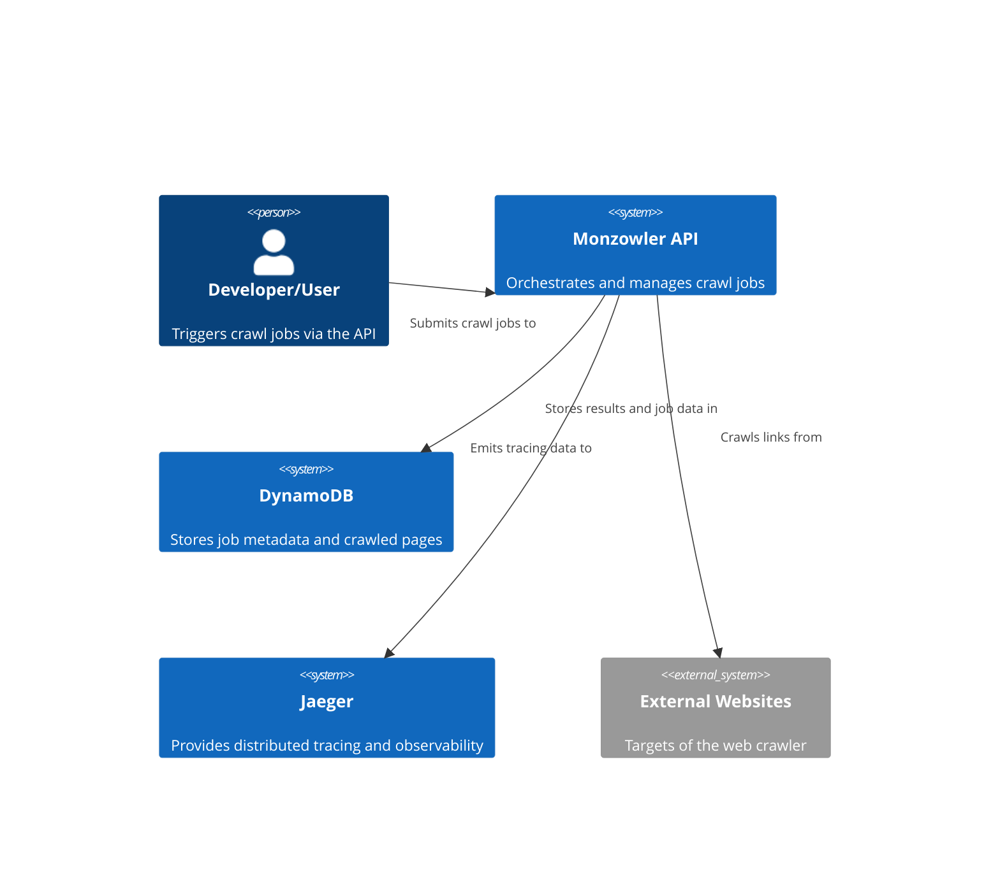

# Architecture

## C4 Context Diagram



## Code Architecture

```
src
├── Api
│   └── Monzowler.Api
|   └── Monzowler.CLI
├── Core
│   ├── Monzowler.Application
│   ├── Monzowler.Domain
│   └── Monzowler.Shared
├── Infrastructure
│   ├── Monzowler.HttpClient
│   └── Monzowler.Persistence
test
```
When developing this services I tried to mimic a _Clean Architecture_ structure. The reason is because I wanted to organize code into layers and enforce a clear separation of concerns to make the code more scalable, maintainable, and testable.

I realise that using _Clean architecture_ might be a bit of an overkill for this project, but I believe is good practise to do so in general, specially if the project is going to grow with more engineers working on it, so I decided to refactor my original code to accomodate it.
Here's a breakdown of the layers:

1. **Api Layer (Monzowler.Api & Monzowler.CLI)**
  - This layer acts as the entry point for the Web Crawler. I made it decoupled so it could be either our API or the Command line interface. 
  - Responsible for interacting with external clients, handling HTTP requests, and returning responses.
2. **Core Layer** : This is the business logic layer. Divided into three subproject:
  - **Monzowler.Application**: Contains the application service layer. Responsible for orchestrating domain logic and managing workflows. Here we also store Interfaces inside `/Contracts` (e.g., ISpiderServices).
  - **Monzowler.Domain**: The core business logic and entities reside here. This layer doesn't depend on any external frameworks or libraries, but rather all dependent from this layer.
  - **Monzowler.Shared**: For cross-cutting concerns like utilities, observability, or shared logic between different layers. I created this layer avoid duplication and centralize reusable code.
3. **Infrastructure Layer**: The outer layer
  - **Monzowler.ApiClient**: code for interacting with external APIs or third-party services (in our case, the Mount Bank container).
  - **Monzowler.Persistence**: Responsible for data access and persistence, in this case just dynamoDB but in the future extendable for other persistence such as Redis. 

## Observability

Distributed tracing is critical for applications, especially those based on microservices architectures, where requests often traverse multiple services.
It can provide insight into the flow of requests, and help diagnose performance bottlenecks, errors, and improve overall system reliability.

For this project I decided to use Jaeger as our OTEL exporter. The reason is because is an open-source tool and integrates well into ASP .NET, and since this is
an MVP project this should cover everything. Currently we have a very simple Observability ecosystem, but as an MVP it works as a proof of concept.

When running the `docker-compose.yaml`, you should be able to see the trace and spans for each request, under http://localhost:16686.

## Politeness & `Robots.txt`

Something I discovered a while ago is that politeness is paramount for most of webcrawlers - we don't want to overload domains to look like they are having DDoS attacks or simply not degrage their performance.
That's why websites have the `/robots.txt` file with certain rules to follow on what websites are good / not good to crawl, subdomains that are not disallowed, etc.

On our webcrawler this is done through the `RobotsTxtService`, which tries to parse the file according to the robots specs. I tried to cover most of it but as I started working on it I realised how complex was becoming!
So covered most of the use-cases for our MVP.

Particularly, one thing we implemented is Politeness Throttling. If the `robots.txt` has a `Crawl-delay` directive we will throttle our requests and await calls for that period of time. 

## Parsers

After receiving a response from the API, the worker must parse the HTML and extract all crawlable links. 
This is typically done by scanning for anchor (`<a>`) tags and retrieving their href attributes. 

While this is straightforward for static websites, modern JavaScript-heavy sites introduce additional complexity.

The main parsing challenges are:

### 1. Static vs. Dynamic Content
   Static websites expose all their content directly in the HTML response. For these cases, I used a fast and reliable static HTML parser built on the `HtmlAgilityPack`, which efficiently extracts all anchor tags. 
   JavaScript-rendered websites (e.g., React, Angular, Vue) often require running JavaScript to populate the DOM. These pages return a minimal HTML shell and load content dynamically via JS. To handle this, I created a rendered HTML parser that uses Selenium and chromedriver under the hood which loads the page in a real browser, waits for JS to execute, and extracts the final DOM.
    Because dynamic rendering is significantly slower, I implemented a fallback mechanism: first we attempt to parse using the static parser first. If it doesn't return any links or the content appears incomplete, fallbacks to the rendered parser.
  
### 2. Link Sanitization
   Many links may be invalid or irrelevant for crawling (e.g., links to PDFs, images, mailto, etc.). As a result, all extracted links are passed through a sanitization process to normalize relative URLs into absolute ones, discard non-HTTP(S) links or links to unsupported formats, etc.

# Concurrency Model

As we want to make our Web Crawler performant and efficient I want to be able to allow concurrent tasks for all the different URLs. After considering different options,
I decided to use a consumer-producer pattern via .NET's `Channel<T>`.`Channel<T>` is implemented with low-lock and async-native constructs, whereas lock/SemaphoreSlim uses traditional synchronization primitives that scale worse under high contention.
Also, is more readable approach, less error-prone and more mantainable!

As a summary, Channels are an implementation of the producer/consumer programming model: producers asynchronously produce data, and consumers asynchronously consume that data. The data is passed in a FIFO (First-In, First-Out) queue data structure.

The approach taken is the following:
- The main thread starts by enqueuing the root link into our `Channel<Link>`, encapsulated in the `CrawlerSession` class.
- We generate a number of concurrent worker to consume the channel (limited by the `MaxConcurrenty` settings). The `await foreach (var item in session.ChannelSession.Reader.ReadAllAsync())` will block until a link is available in the channel.
- The worker pulls a message from the channel when available, and does a few things:
    - Downloads the page at the link URL
    - Parses the HTML (either static or dynamically rendered — see the `Parsers` section).
    - Checks if the link has been visited or exceeds `maxDepth` (using thread-safe HashMap/Dictionaries to avoid data races).
    - If valid, messages are enqueued into the channel for further crawling.

A key challenge was knowing when to shut down the crawler. Since `ReadAllAsync()` blocks indefinitely unless the channel is closed, we needed a safe way to signal completion when no more work remains. So I introduced a thread-safe work item counter, which:
- Increments each time a link is enqueued.
- Decrements when a link is fully processed.
- When the counter reaches zero, it completes the channel - which signals the workers to exit.
  Special care needs to be done to ensure it's peforming atomic increase/decrease operations, otherwise we risk to have race conditions. This can be done using Interlocked or pure locks.
  I choose Interlock because it much more faster (CPU instruction level).

Another important thing to mention is the use of `CancellationToken` in the code, which provides a way to gracefully cancel an ongoing operation that might be run for a very long time. This is important so we don't keep processing a url for a very long time and fail 
within a time window. 

## Alternatives Considered
Before choosing Channel<T>, I evaluated several other concurrency approaches. Below is a summary of the alternatives and why they were not selected:

### Pure async/await
While async/await is excellent for non-blocking I/O, it is inherently sequential unless explicitly combined with concurrency control. 

In the context of a web crawler — where thousands of independent pages may be crawled in parallel — using plain async/await results in inefficient throughput without an explicit concurrency strategy.
Though the await keyword does free up the thread to handle other work, each operation still completes in sequence by default unless explicitly parallelized. This pattern is more suitable for request-response style applications (e.g., web APIs), not for recursive, high-throughput crawling.

### Pure Multithreading (Task.WhenAll, or unbounded Task.Run)
An early attempt involved launching tasks for each discovered URL and aggregating them using Task.WhenAll(). 
While this introduced concurrency, it lacked coordinated control and introduced several major issues:
- Unbounded concurrency: Without a queue or throttling mechanism, this approach led to thousands of tasks and high memory/CPU pressure.
- No backpressure: The system could easily overwhelm downstream services or exhaust the thread pool.
 -Difficult shutdown logic: Coordinating cancellation, retries, or failure recovery across thousands of in-flight tasks was complex and fragile.

While throttling could be introduced (e.g., using `SemaphoreSlim`), this added complexity and still lacked a centralized state management system for URLs, retries, and link discovery.
In practice, this model proved inefficient, error-prone, and hard to scale for recursive crawling.

## Persistence

The main datastore used for the web crawler is DynamoDB. Despite its potential cost and vendor lock-in, is a fully managed, highly scalable, key-value store that 
has shown to be extremely fast on both read and write operations, and since we don't require strong schema nor complex queries, and our access patterns are quite simple,
I decided this was a good option. 

In the project this is set up in the dockerfile using localstack and AWS CLI.

## HTTP Client

Our HTTP client is built on top of the native .NET HttpClient, and is enhanced with the following key features:

- *Retry Logic for Transient Failures:* Automatically retries requests when transient errors occur, which includes:
   - 408 Request Timeout 
   - 429 Too Many Requests 
   - 5xx server errors (e.g., 500, 502, 503, 504)

- *Polite Throttling:* When a site's `/robots.txt` specifies a crawl delay or restricts access, the client respects these directives by introducing appropriate throttling between requests. This ensures our crawler behaves responsibly and avoids overloading servers.