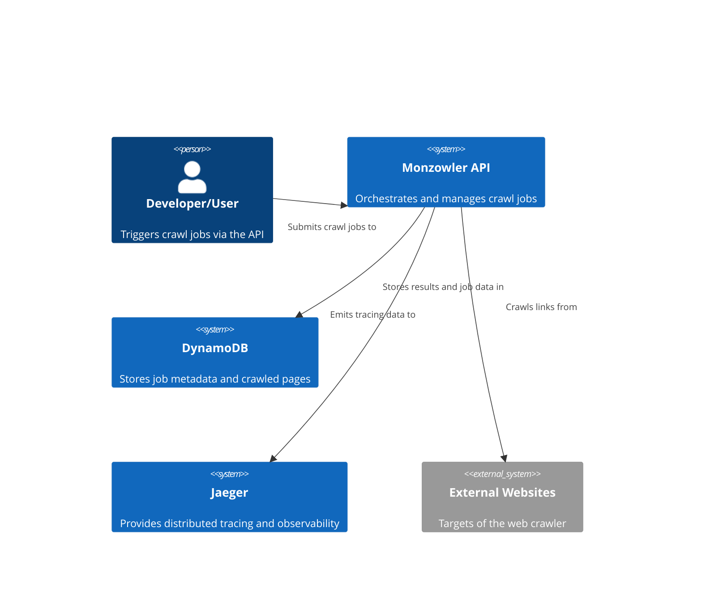

# Architecture

## C4 Context Diagram

### Code Architecture

When implementing the webcrawler I decided to use a clean architecture approach. 

## Observability

Distributed tracing is critical for applications, especially those based on microservices architectures, where requests often traverse multiple services.
It can provide insight into the flow of requests, and help diagnose performance bottlenecks, errors, and improve overall system reliability.

For this project I decided to use Jaeger as our OTEL exporter. The reason is because is an open-source tool and integrates well into ASP .NET, and since this is
an MVP project this should cover everything. Currently we have a very simple Observability ecosystem, but as an MVP it works as a proof of concept.

When running the `docker-compose.yml`, you should be able to see the trace and spans for each request, under http://localhost:16686.

## Politeness & `Robots.txt`

Something I discovered a while ago is that politeness is paramount for most of webcrawlers - we don't want to overload domains to look like they are having DDoS attacks or simply not degrage their performance.
That's why websites have the `/robots.txt` file with certain rules to follow on what websites are good / not good to crawl, subdomains that are not disallowed, etc.

On our webcrawler this is done through the `RobotsTxtService`

Additionally, we also ready the `After-Delay` rule, which is not a mandatory field in the robots.txt spec but an interesting use-case that we implemented. See below on the HttpClient section for more info.

## HTTP Client

The Http Client is written to be able to be performant and fast.

Additionally, it handles retries and throttling request when there is a requested delay from the `/robots.txt`

### Retry logic
Using `Polly` library, we can easily set some retries to the calling API when the URL experience either 5xx error codes or timeouts `408`. In that case, we setup an exponential backoff retry.
We also included the `429 too Many Requests` error code - we shouldn't hit this, but if we do there is a `Retry-After` header that we can read and throttle.

### Polite Throttling

TBD

## Parsers

Once our worker gets a response from the API, as per our task requirements we need to be able to parse the HTML, and extract the links.
This is relatively simple: In HTML, the anchor tag (<`a>`) creates hyperlinks so we just need to retrieve this from the DOM, and extract the `href` link.
The difficulty are mainly two:
- For Static websites this simple - we just need to extract links from the anchor tags. However modern websites are JavaScript-heavy websites, and they need rendering before getting the HTML (unless it's been SEO-optimised). In order to solve this, we created two parsers:
    - Static HTML parser: Fast and simple, using a popular library, `HtmlAgilityPack`.
    - Rendered HTLM Parser using selenium: Much slower because it requires running the browser through a WebDriver (in our case `chromedriver`) , copying the heavy JS code and past in a blank page and wait for completion.
    - Because the latter is much slower, we set up a fallback mechanism to first run static HTML parser, and if fails try the other one.
- Some of these links are broken or are not crawlable (e.g. pdfs, jpg, etc), so we need to sanitize them

With that, we created an efficient parser flow logic that handles different exceptions and sets the Parser status code.

# Concurrency Model

As we want to make our Web Crawler performant and efficient we want to be able to allow concurrent tasks for all the different URLs. After considering different options,
I decided to use a consumer-producer pattern via .NET's `Channel<T>`.`Channel<T>` is implemented with low-lock and async-native constructs, whereas lock/SemaphoreSlim uses traditional synchronization primitives that scale worse under high contention.
Also, is more readable approach, less error-prone and more mantainable!

As a summary, Channels are an implementation of the producer/consumer programming model: producers asynchronously produce data, and consumers asynchronously consume that data. The data is passed in a FIFO (First-In, First-Out) queue data structure.

The approach taken is the following:
- The main thread starts by enqueuing the root link into our `Channel<Link>`, encapsulated in the `CrawlerSession` class.
- We generate a number of concurrent worker to consume the channel (limited by the `MaxConcurrenty` settings). The `await foreach (var item in session.ChannelSession.Reader.ReadAllAsync())` will block until a link is available in the channel.
- The worker pulls a message from the channel when available, and does a few things:
    - Downloads the page at the link URL
    - Parses the HTML (either static or dynamically rendered — see the `Parsers` section).
    - Checks if the link has been visited or exceeds `maxDepth` (using thread-safe HashMap/Dictionaries to avoid data races).
    - If valid, messages are enqueued into the channel for further crawling.

A key challenge was knowing when to shut down the crawler. Since ReadAllAsync() blocks indefinitely unless the channel is closed, we needed a safe way to signal completion when no more work remains. So I introduced a thread-safe work item counter, where we:
- Increments each time a link is enqueued.
- Decrements when a link is fully processed.
- When the counter reaches zero, we complete the channel - which signals the workers to exit.
  Special care needs to be done to ensure we are peforming atomic increase/decrease operations, otherwise we risk to have race conditions. This can be done using Interlocked or pure locks.
  I choose Interlock because it much more faster (CPU instruction level).

Another important thing to mention is the use of `CancellationToken` in the code. At any point in our request it could be possible there are some block
## Alternatives

Other alternatives where explored first, see below why they weren't chosen.

### Pure `Async/Await`:
While the pure async/await model works correctly and efficiently on a per-operation basis, it is less performant in our context because it executes sequentially by default. Even though await allows the thread to return to the thread pool (freeing it for other work), each operation still waits for the previous one to complete before starting the next.

This pattern is ideal for I/O-bound, request/response-style applications like web APIs, where multiple client requests are processed concurrently using the same shared thread pool. However, in our case — a recursive, high-throughput web crawler — we need to process many independent HTTP requests concurrently to maximize throughput.

To achieve that, we require true parallelism and concurrency — not just non-blocking I/O — so we can crawl multiple pages at once, discover more links, and fan out the crawl efficiently. This is where the producer-consumer model with Channel<T> and a controlled number of async workers becomes far more effective.

### Pure Multithreading:
The initial approach was to spawn multiple asynchronous tasks for each URL using Task.WhenAll() to wait for them to complete. While this provides basic concurrency, it lacks central coordination, and quickly becomes problematic as the number of discovered links grows.

This model leads to:

- Unbounded concurrency, where hundreds or thousands of tasks may be created with no throttling
- Thread pool exhaustion in high-load scenarios
- No backpressure, making it easy to overwhelm system or network resources
- Difficult error handling and retries, especially for transient failures or timeouts

While some of these issues can be mitigated (e.g., using `SemaphoreSlim` to cap concurrency), doing so adds complexity, and still lacks a centralized, coordinated pipeline for managing crawl state, retries, and graceful shutdown.
In practice, it became clear that this approach was both inefficient and hard to maintain for a recursive, stateful crawling task.
